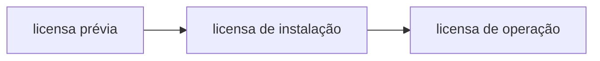

## Meio ambiente 

19/07/2025 -> periodo da manhã
Prof Nicole -> bióloga

- video sobre a undústria e o consumo -> sistema linear.

---

Legislação brasildeira 

- código das águas 1935
- código florestal 1935
- lei de proteção à fauna 1967
- lei de politica ambiental
- Constituição de 1988: 
	- competências executivas ( presidencia, estados, municípios)
	- competências legislativas (camara, senado)
	
> a solução mais restritiva prevalece  _"in dubio pro natura"_

**Instrumentos da PNMA** - estudo de impacto ambiental e licenciamento ambiental
 
---

### Licenciamento

procedimento administrativo que licencia a localização, instalação, ampliação e a operação do empreendimento/atividade. 

Realização do EIA + RIMA 
EIA -> documento resumido - linguagem acessivél - livreto;

		- informações gerais:
			nome do empreendedor
			histórico do empreendimento, obj e justificativas
			localização geográfica (macro)
		- caracterização do empreendimento;
			objetivos e justificativas 
		- área de influência 
		- diagnóstico ambiental 
		- análise dos impactos ambientais 
		- medidas mitigadoras 
		- programa de monitoramento 

RIMA -> documento técnico - linguagem científica;

### TO DO: trabalho video 

## Gestão ambiental 2 

19/07/2025 - período da tarde 
Prof Luciana (9 anos de Lac) -> bióloga futura médica veterinária 
toxicologia 
ex: disseminação de hormonios na agua pode causar a troca de sexo de um peixe. 

TO DO:  1º de agosto 
escrever sobre algum exemplo global poluição. encontrar uma empresa que trabalha na área do exemplo que poderia fazer algo para solucionar/minimizar. 
 
> **ESG** é ferramenta não gestão ambiental. 
---

### Conceitos e Definições 

**Gestão Ambiental** -> organizar e mapear processos e utilizar de ferramentas para minimizar impactos. 
**Inovação** -> novo, coisa nova, novidade. 
**Sustentabilidade** -> o que é sustentavel, para quem? propriedade de processo ou sistema que permite a permanência, em certo grau, por determinado prazo. 
**Meio Ambiente** -> Conjunto de condições que afetam a existência, desenvolvimento e bem estar dos seres vivos. 

Sinergia ambiental -> equilibrio dos ecossistemas. 

Processo de devastação ambiental / crise ambiental vem sendo feito há milhares de anos. apartir da segunda revolução industrial foi-se evidenciada a situação de crise ambiental. 

### Impactos ambientais 
"Qualquer ateração das propriedades físicas, químicas e biológicas do meio ambiente causada por qualquer forma de matéria ou energia resultante das atividades humanas que direta ou indiretamente afetam: 
1. a saúde, a segurança e o bem estar da população. 
2. as atividades sociais e econômicas. 
3. a biota. 
4. as condições estéticas e sanitárias do meio ambiente. 
5. qualidade dos recursos ambientais. "

via de mão dupla, traz impactos ambientais positivos e negativos, também elege nível do impacto e perpetuação. 

### Poluição 

É uma alteração ecológica provocada pelo ser humano, que prejudica, direta ou indiretamente, sua vida ou seu bem-estar, trazendo danos aos recursos naturais e impedimento as atividades ambientais e econômicas. 

Poluição tem uma conotação negativa, é algo indesejável e tem relação com matéria ou energia - grandezas físicas que podem ser medidas para o estabelecimento de padrões. 
 
### Impactos ambientais VS Poluição 

- varias ações humanas causam impactos ambientais mesmo sem envolver a emissão de poluentes. 
- toda a poluição causa impacto ambiental, mas nem todo impacto tem poluição como causa. 
-> gestão de separação de lixo de apartamento fazendo a separação e descarte correto que gera renda para a diminuição do aluguel dos moradores. 

###  Poluição VS Contaminação 

Contaminação é a presença, em um ambiente, de seres patogênicos ou substâncias capazes de causar alteração ao ambiente e ao ser humano; no entanto, se não resultar em uma alteração nas relações ecológicas, a contaminação não é uma forma de poluição. 

Poluição esta diretamente relacionada a perda de equilíbrio ecossistêmico e consequentemente das funções do mesmo.

---

### ALTERAÇÕES CLIMÁTICAS (IPCC)

| Tendência                          | Efeitos esperados ou já observados                                                                 |
|-----------------------------------|-----------------------------------------------------------------------------------------------------|
| ⬆ Temperatura da Superfície do Oceano | Redução no gelo em latitudes polares, aumento no branqueamento de corais, aumento em *blooms* de algas |
| ⬆ Concentração de CO₂              | Redução no pH do oceano, afetando recifes de corais e outros organismos sensíveis a pH             |
| ⬆ Nível do Mar                     | Inundação, erosão, entrada de água salgada, redução na drenagem                                     |
| ⬆ Frequência de Tempestades       | Aumento no tamanho das ondas, inundações                                                            |
| ⬆ Efluentes                        | Alteração na salinidade de águas costeiras, no suprimento fluvial, circulação de nutrientes         |

---

### Gestão Ambiental 

- reduzir impactos severos sobre recursos naturais 
- minimizar a ocorrência desastres ambientais 
- reduzir custos de recuperação 

### Desenvolvimento Sustentável 

Tecnologia + Economia + Meio Ambiente
" o desenvolvimento que satisfaz as necessidades presentes, sem comprometer a capacidade das gerações futuras de suprir suas próprias necessidades" ( Comissã Mundial do Desenvolvimento e Meio Ambiente - "Nosso Futuro Comum", 1987).

- para proxima aula continuar do video do Banco Real 2009. 
